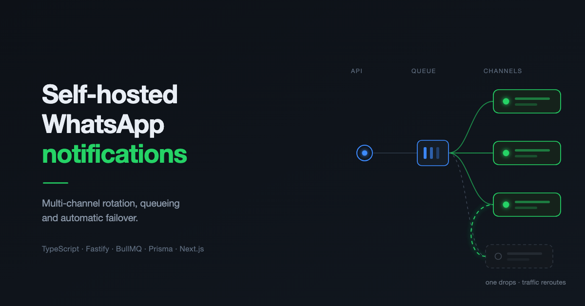
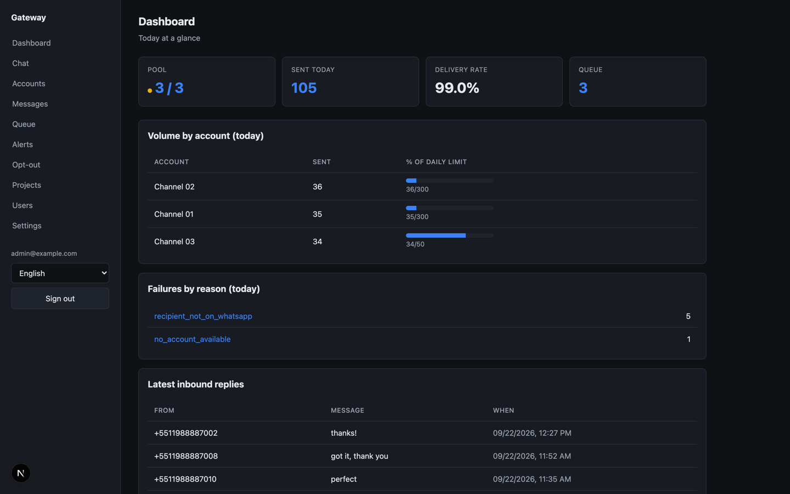
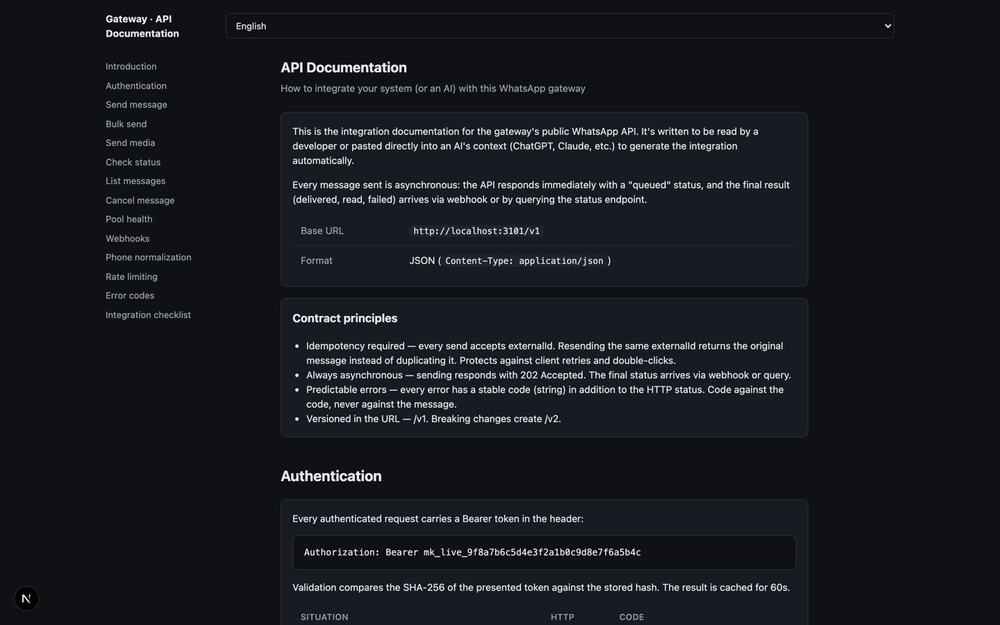
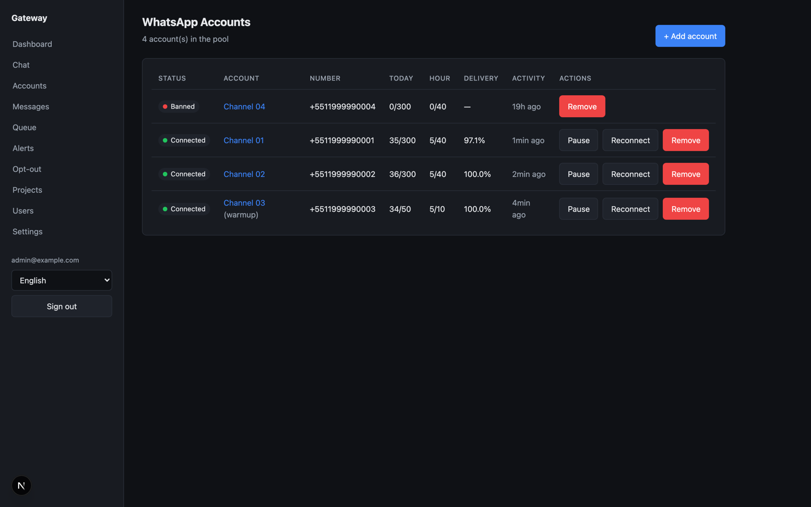
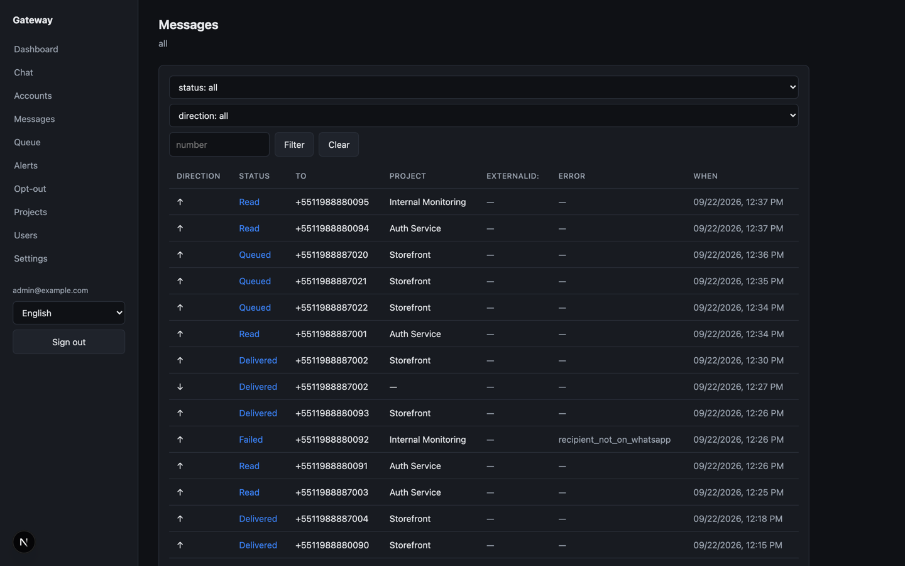
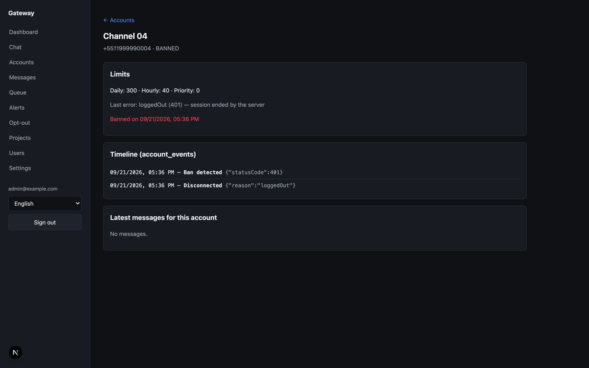
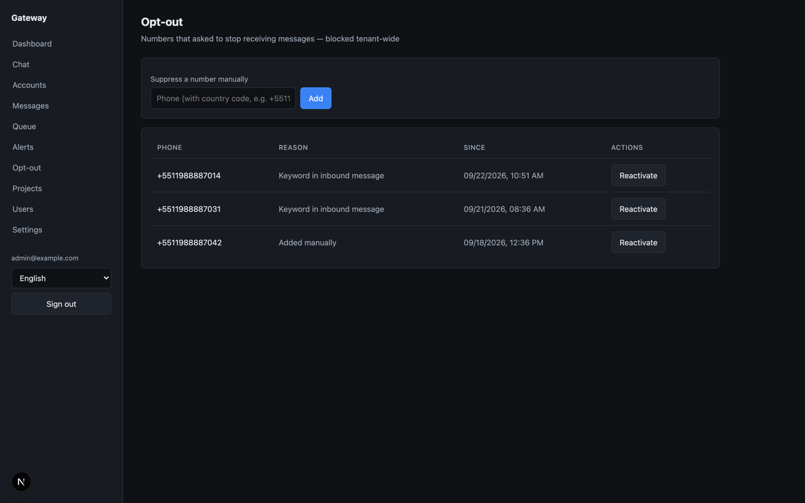
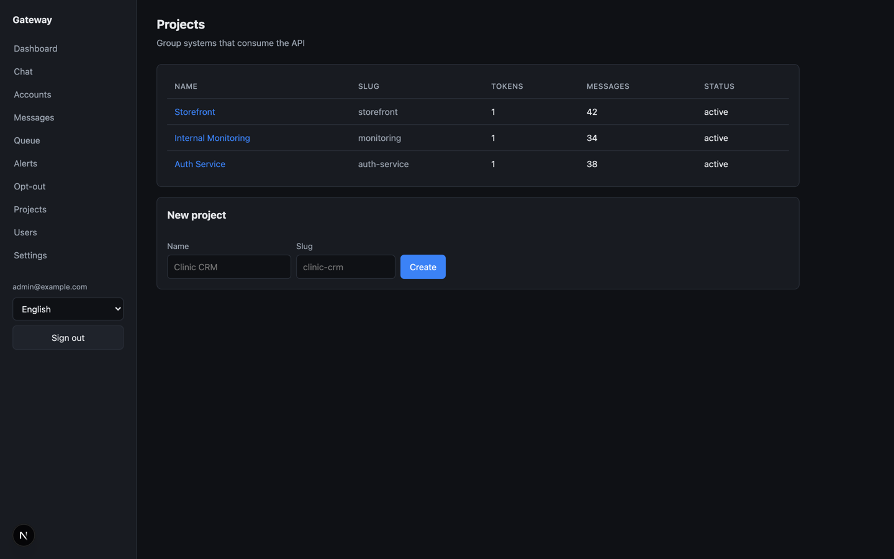

# wpp-gateway

A self-hosted WhatsApp notification gateway. One HTTP API that any number of
your systems can call to send messages, backed by a pool of WhatsApp accounts
with automatic rotation, queueing and failover.

Built because I needed my systems to notify me on a channel I actually check.

> ⚠️ **Intended use:** transactional messages the recipient asked for or expects
> — OTPs, sign-up confirmations, system alerts, status updates. This is not a
> bulk marketing tool. See [Responsible use](#responsible-use).



*Dashboard: pool status, volume per channel against each one's daily cap, failures by reason, and the latest inbound replies.*

---

## Why this exists

I run several systems and I wanted all of them to notify me about things:
someone signed up on my site, an OTP, an alert. Email I get to eventually.
WhatsApp I have open all day.

The obvious answer is the official WhatsApp Business API. I looked at it. But
between creating the account, going through approval, activating it, getting
every message template reviewed and paying per conversation, the cost and the
bureaucracy didn't justify themselves for my volume.

So I took the pragmatic path: WhatsApp Web, through
[Baileys](https://github.com/WhiskeySockets/Baileys). Simpler, cheap, solves my
problem.

**That path has exactly one real drawback: channels go down.** If Meta flags an
account for spam or misuse, it's gone — no warning, no appeal.

That's why the platform takes multiple channels from the start, and why most of
the engineering here goes into rotation, delays and queueing — keeping accounts
off that list, and keeping messages flowing when one of them does drop.

I'm clear-eyed about the trade-off: if a channel goes down, so be it. I buy
another SIM and move on. The architecture exists so that a channel dropping is
an inconvenience, not an outage.

---

## How it works

```
┌──────────┐  ┌──────────┐  ┌──────────┐
│ System A │  │ System B │  │ System C │
└────┬─────┘  └────┬─────┘  └────┬─────┘
     │ token A     │ token B     │ token C
     └─────────────┼─────────────┘
                   ▼
       ┌───────────────────────┐
       │   HTTP API (Fastify)  │  auth, validation, rate limit
       └───────────┬───────────┘
                   ▼
       ┌───────────────────────┐
       │  Queue (BullMQ/Redis) │  retry, backoff, priority
       └───────────┬───────────┘
                   ▼
       ┌───────────────────────┐
       │   Worker (Baileys)    │  channel rotation + pacing
       └───────────┬───────────┘
      ┌────────┬───┴────┬────────┐
      ▼        ▼        ▼        ▼
  Channel 1 Channel 2 Channel 3 Channel N
      └────────┴────────┴────────┘
                   ▼
              Recipients
```

Sending is **asynchronous by design**. The HTTP call returns as soon as the
message is queued, not when WhatsApp delivers it. That keeps WhatsApp Web's
latency and flakiness out of your callers' response times, and it's what makes
retrying on a different channel possible without the caller ever knowing.

---

## Features

### Keeping channels alive

| Feature | What it does |
|---|---|
| **Channel rotation** | Each send picks randomly from the available pool instead of hammering one account |
| **Randomized delay** | ±30% jitter between sends — regular cadence is what gives automation away |
| **Warmup** | New accounts start with reduced limits for 7 days |
| **Quiet hours** | Nothing goes out between 23:00–06:00 (configurable, in the tenant's timezone) |
| **Hourly/daily caps** | Conservative per-account limits, enforced per channel |
| **Typing indicator** | Sends `composing` before each message |
| **Number validation** | Checks the number exists on WhatsApp before sending, with caching |
| **Real opt-out** | Blocks further sends to a contact, not just logs the request |

### When a channel drops anyway

| Feature | What it does |
|---|---|
| **Queue failover** | A failed send re-queues on a *different* channel instead of being lost |
| **Disconnect classification** | Tells a real ban (401/403) apart from a transient stream error — retiring a healthy account that just needed to reconnect drains the pool for nothing |
| **Active detection + alerts** | Offline channels trigger a WhatsApp and email alert. Silent failure is the worst outcome: messages vanish and nobody knows |
| **Session persistence** | WhatsApp sessions survive restarts and redeploys — no re-scanning QR codes |

### Operations

| Feature | What it does |
|---|---|
| **Per-project tokens** | Each consuming system gets its own token, quota and rate limit |
| **Inbound capture** | Replies are captured and delivered via webhook, enabling two-way flows |
| **Media** | Images and PDFs, not just text |
| **Admin panel** | QR pairing, usage dashboards, message history, quota management |
| **2FA** | Argon2 + TOTP on panel login |
| **Multi-tenant** | Fully isolated deploys on one host, routed by domain |
| **i18n** | Panel available in English, Portuguese and Spanish |
| **Per-tenant timezone** | Quiet hours, daily caps and dashboard "today" follow the tenant's timezone, not the server's |
| **Data retention** | Message history is dropped after `RETENTION_DAYS` (default 90) by a nightly job — partition drops rather than row deletes, so it's instant and reclaims disk |

---

## Stack

| Layer | Choice |
|---|---|
| Language | TypeScript (Node 22, ESM) |
| Monorepo | pnpm workspaces + Turborepo |
| API | Fastify 5 + Zod |
| Queue | BullMQ + Redis 7 |
| WhatsApp | Baileys 6.7 (WhatsApp Web, unofficial) |
| Database | PostgreSQL 16 + Prisma 6 |
| Panel | Next.js 15 + React 19 + Tailwind |
| Panel auth | Argon2 + TOTP |
| Logging | Pino + CloudWatch |
| Infra | AWS EC2 (ARM), Docker Compose, Caddy, S3 |
| Tests | Vitest (29 suites) |

Around 15k lines of TypeScript across `apps/` and `packages/`.

```
apps/
  api/        public HTTP API (Fastify)
  worker/     queue consumer + WhatsApp sessions (Baileys)
  panel/      admin panel (Next.js)
packages/
  config/     env vars validated with Zod
  database/   Prisma schema + migrations
  queue/      queue abstraction (BullMQ)
  shared/     shared types and utilities
  email/      transactional email
docker/       dev and production compose files
scripts/      deploy, backup, administration
docs/         architecture documentation
```

---

## API

Authenticate with a per-project token: `Authorization: Bearer <token>`.

```http
POST /v1/messages          send a message
POST /v1/messages/bulk     send a batch
POST /v1/messages/media    send an image or PDF
GET  /v1/messages          query status and history
POST /v1/webhook/test      test your webhook endpoint
GET  /v1/health            health check (no auth)
```

```bash
curl -X POST https://your-domain/v1/messages \
  -H "Authorization: Bearer $TOKEN" \
  -H "Content-Type: application/json" \
  -d '{"to":"5511999998888","text":"Your code is 123456"}'
```

The response returns immediately with a message ID; delivery status is available
via `GET /v1/messages` or pushed to your webhook. Incoming replies are delivered
to the same webhook.

### Integration docs, served by the gateway itself



Every deploy serves its own integration reference at **`/docs/api`** — public,
no login, in English, Portuguese and Spanish. Fourteen sections covering
authentication, each endpoint, webhooks, phone normalization, rate limiting,
error codes and an integration checklist.

It states the contract explicitly, so client authors don't have to infer it:

- **Idempotency required** — every send accepts an `externalId`. Resending the
  same one returns the original message with `200` instead of duplicating it,
  which is what makes client retries and double-clicks safe.
- **Always asynchronous** — a new send returns `202 Accepted`; the final status
  arrives by webhook or query.
- **Predictable errors** — every error carries a stable string code alongside the
  HTTP status. Code against the code, never against the message text.
- **Versioned in the URL** — `/v1`; breaking changes would create `/v2`.

The page is also written to be pasted straight into an LLM's context to generate
a client, which is why it spells out the full contract rather than assuming a
human will fill in the gaps.

---

## Admin panel

Available in English, Portuguese and Spanish:

- **Channels** — pair accounts by QR code, monitor status, warmup progress
- **Dashboard** — usage per project and per channel
- **Projects** — tokens, quotas, rate limits
- **Messages** — full history, delivery status, conversation view
- **Queue** — what's pending, what failed, what's retrying
- **Opt-out** — manage blocked contacts
- **Alerts** — configure where channel-down notifications go
- **Users** — panel access with mandatory 2FA

### Channels



The pool at a glance: two healthy channels, one still in warmup on reduced
limits, and one banned. Per-channel delivery rate and hourly/daily counters make
it obvious which channel is carrying traffic and which is being held back.

### Messages



Every message, inbound and outbound, with its status, the project that sent it
and the error when one failed.

### Channel detail



The event timeline for a channel that went down. `Ban detected {"statusCode":401}`
is the distinction that matters: a 401 is a real ban and the channel is retired,
while a transient stream error would simply reconnect.

### Opt-out



A contact who replied STOP is blocked tenant-wide, not merely logged — the
suppression is enforced on every subsequent send.

### Projects



Each consuming system gets its own token, quota and rate limit.

---

## Quick start

Requirements: Node 22+, pnpm 11+, Docker.

```bash
git clone <this-repo> && cd wpp-gateway
pnpm install
cp .env.example .env
```

Generate the three secrets and put them in `.env`:

```bash
openssl rand -hex 32   # ENCRYPTION_KEY
openssl rand -hex 32   # SESSION_SECRET
openssl rand -hex 32   # PANEL_SESSION_SECRET
openssl rand -hex 32   # INTERNAL_API_TOKEN
```

Then:

```bash
pnpm infra:up      # PostgreSQL 16 + Redis 7 in Docker
pnpm db:deploy     # run migrations
pnpm db:seed       # create admin user + sample project token
pnpm dev           # api :3000 · panel :3001 · worker
```

Open http://localhost:3001, complete the admin setup (password + 2FA), then add
your first channel and pair it by scanning the QR code with the WhatsApp account
you want to send from.

| Command | What it does |
|---|---|
| `pnpm infra:up` / `infra:down` | start/stop PostgreSQL and Redis |
| `pnpm db:migrate` | create a migration (dev) |
| `pnpm db:studio` | open Prisma Studio |
| `pnpm test:all` | run all tests |
| `pnpm build` | build all packages |
| `pnpm lint` / `pnpm format` | lint and format |

**Production deployment:** see **[DEPLOYMENT.md](DEPLOYMENT.md)** for the full
guide — single host, multi-tenant, AWS with CI/CD, backups and TLS.

---

## Configuration

All configuration is environment variables, validated with Zod at startup — the
service refuses to boot if something is missing or malformed. Full list in
[`.env.example`](.env.example).

The ones that matter most:

| Variable | What it controls |
|---|---|
| `ENCRYPTION_KEY` | Encrypts WhatsApp session credentials at rest |
| `SESSION_SECRET` / `PANEL_SESSION_SECRET` | Session signing |
| `INTERNAL_API_TOKEN` | Worker ↔ panel authentication (not a project token) |
| `TENANT_TIMEZONE` | IANA name. Decides quiet hours, when daily caps reset, and the dashboard's "today". The server runs in UTC — without this, everything rolls over at UTC midnight |
| `SILENT_HOURS_START` / `_END` | Quiet window, in the tenant's local hours |
| `DEFAULT_DAILY_LIMIT` / `_HOURLY_LIMIT` | Per-channel caps |
| `WARMUP_DAYS` | How long new channels stay throttled |
| `ALERT_WHATSAPP_NUMBER` / `ALERT_EMAIL` | Where channel-down alerts go |
| `PANEL_PUBLIC_URL` / `PANEL_BRAND_NAME` | White-label identity for this deploy |

### White-label

The code references no brand. Each deploy is an independent instance — its own
domain, its own channel pool, its own database — configured entirely through
`PANEL_PUBLIC_URL` and `PANEL_BRAND_NAME`.

---

## Responsible use

WhatsApp automation is sensitive territory, so let me be explicit.

**What this is for:** messages the recipient asked for or expects — a sign-up
confirmation, a verification code, a system alert, a delivery update.

**What it isn't for:** bulk sends to purchased lists, unsolicited marketing,
anything nobody asked to receive.

This isn't just a principled stance — it's the constraint that shapes the
architecture. The strongest signal for getting an account banned isn't volume,
it's **user reports**. No amount of randomized delay compensates for unwanted
messages: a handful of "Block and report" taps kills an account faster than any
volume heuristic. That's why opt-out actually blocks resends rather than merely
logging the request, and why the default limits are deliberately conservative.

**On Terms of Service:** using unofficial libraries like Baileys violates
WhatsApp's ToS, and Meta can ban any account without notice or appeal. For
commercial use at scale, the correct path is the
[official WhatsApp Business Platform](https://business.whatsapp.com/products/business-platform).
This project exists for low-volume cases where that path isn't worth the cost
and overhead — and it treats bans as a statistical certainty rather than a
remote risk.

### Your responsibility as an operator

**You are the data controller for everything you send through this gateway.**
This software moves messages; it does not give you the right to send them.

If you deploy it, it is on you to:

- **Have a lawful basis for contacting each recipient.** Under GDPR, Brazil's
  LGPD and equivalent regimes, a phone number is personal data. Messages someone
  asked for — a code they requested, an order they placed — normally rest on
  performing a contract. A list you bought does not rest on anything.
- **Honour opt-outs, and honour them everywhere.** The gateway enforces
  suppression on its own sends; it can't know about a request someone made to
  you by another channel.
- **Tell people how you'll reach them,** in whatever privacy notice covers the
  service they signed up for.
- **Keep what you collect to what you need.** Message history is deleted
  automatically after `RETENTION_DAYS` (default 90); set it to whatever your
  retention policy actually is. Details in
  [`docs/02-modelo-de-dados.md`](docs/02-modelo-de-dados.md) §3.
- **Comply with the local rules** wherever your recipients are — messaging,
  consent and marketing law vary by country, and the recipient's country is the
  one that counts.

The defaults here are conservative and the opt-out is real, but no software
setting makes an unlawful send lawful. The project is offered as-is, with no
warranty (see [LICENSE](LICENSE)); the legal consequences of what you send are
yours, not the author's.

---

## Documentation

The project was designed before it was written. The documents in
[`docs/`](docs/) record those decisions — **they are written in Portuguese**:

| Doc | Topic |
|---|---|
| [00](docs/00-visao-geral.md) | overview and goals |
| [01](docs/01-arquitetura.md) | architecture and components |
| [02](docs/02-modelo-de-dados.md) | data model |
| [03](docs/03-api-publica.md) | public API |
| [04](docs/04-gestao-de-contas.md) | channel lifecycle |
| [05](docs/05-fila-e-fallback.md) | queue, retry and failover |
| [06](docs/06-anti-ban.md) | keeping channels alive |
| [07](docs/07-painel-admin.md) | admin panel |
| [08](docs/08-seguranca-lgpd.md) | security and data protection |
| [09](docs/09-infraestrutura.md) | infrastructure and deploy |
| [10](docs/10-roadmap.md) | roadmap and history |
| [11](docs/11-custos-aws.md) | infrastructure costs |
| [12](docs/12-i18n.md) | internationalization |

---

## License

MIT — see [LICENSE](LICENSE).
